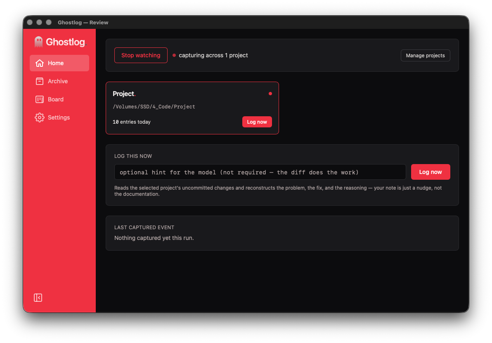
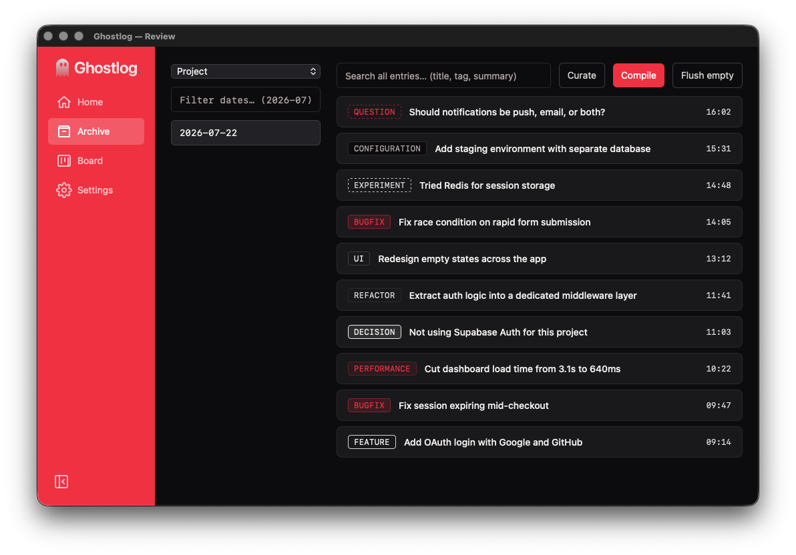
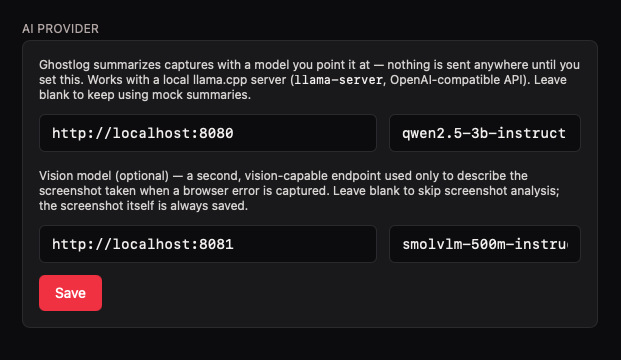

# Ghostlog

Ghostlog is a free, fully open-source, **local-first** dev-notes tool for
macOS (Windows/Linux planned). It sits quietly in your tray, watches the
projects you point it at, and turns what you're already doing — commits,
failed shell commands, moments you flag in a localhost browser tab — into a
running, taggable, searchable log of what happened and why. No account, no
cloud, no telemetry.

The old open-core / pro-tier split was dropped on 2026-07-04. There is no
GHLG-pro repo, no licensing, no paywall — everything lives in this one free
build.

## What it does

Ghostlog captures **entries** from four places, with zero manual note-taking
required for most of them:

| Trigger | How it fires |
|---|---|
| **File changes** | A filesystem watcher on each watched project (git repos only) picks up meaningful edits as you work. |
| **Git commits** | A `post-commit` hook calls Ghostlog's CLI mode, which reads the commit diff and drafts an entry. |
| **Shell errors** | An optional shell hook captures the command and exit code whenever a terminal command fails. |
| **Browser events** | A companion browser extension can flag a moment on a `localhost`/`127.0.0.1` tab — e.g. a console error — optionally attaching a screenshot of the page at that instant. |

Each entry gets a tag, a title, and a summary. If you've pointed Settings at
a local model server, that summary is AI-drafted ("Problem / Fix /
Reasoning") from the diff or the browser screenshot; if not, you get a
clearly-labeled mock draft you can edit by hand — a capture is never lost
just because no model is configured.

From there, the UI (Home → Archive → Curate → Compile) lets you:
- see today's activity per project on **Home**,
- browse and search past sessions in the **Archive**,
- edit/delete/re-tag entries in **Curate**,
- and **Compile** a date range into a single changelog-style document,
  written out to a folder you choose.

## Architecture

Three processes, one Rust binary, and one message-passing boundary each way:

```
┌─────────────────────────────┐
│      Ghostlog.app (Tauri)   │
│                              │
│  ┌────────────┐   IPC only   │
│  │ React UI   │◄────────────►│  Home / Archive / Curate / Compile / Settings
│  │ (webview)  │  (no HTTP)   │
│  └────────────┘              │
│         ▲                    │
│         │ tauri commands     │
│  ┌──────┴─────────────────┐ │
│  │ Rust backend             │ │
│  │  • watcher.rs  (fs)      │ │
│  │  • storage.rs  (entries) │ │
│  │  • ai.rs       (drafts)  │ │
│  │  • tray.rs               │ │
│  └───────────────────────────┘
└──────────────┬───────────────┘
               │ same binary, re-invoked with a flag:
               │   ghlg --ghlg-git-commit <repo>
               │   ghlg --ghlg-shell-error <cmd> <code>
               │   ghlg --ghlg-native-host      ◄── launched by Chrome
               ▼
        ┌─────────────────────┐        stdio, 4-byte length-        ┌───────────────────┐
        │ short-lived CLI      │◄──────  prefixed JSON, in both ───►│ Browser extension  │
        │ subprocess           │        directions (Native Messaging)│ (MV3, localhost-   │
        │ (git hook / shell    │                                     │ scoped)            │
        │  hook / native host) │                                     └───────────────────┘
        └─────────────────────┘
```

Two things worth calling out:

- **There is no separate native-messaging-host binary.** `Ghostlog.app`'s
  own executable is re-invoked by Chrome with `--ghlg-native-host`, reads
  length-prefixed JSON off stdin, and writes a response the same way —
  Chrome starts and kills this subprocess itself, once per
  `chrome.runtime.connectNative()` call. Same for the git and shell hooks:
  they're the same binary, launched with a different flag, so there's one
  codebase and one thing to build/ship.
- **The extension never talks to the app's networking stack, because there
  isn't one.** `manifest.json` requests only `nativeMessaging` +
  `activeTab`/`localhost` host permissions — no `fetch`, no open port to
  connect to even if it wanted to.

## Why local-first

- **Zero network ports, ever.** Frontend ↔ backend is Tauri IPC. App ↔
  browser extension is Native Messaging over stdio — OS-gated to the one
  registered, trusted extension ID, and not reachable or URL-addressable by
  any webpage. There is nothing running on your machine for a stray script
  or malicious site to probe.
- **No cloud calls, no telemetry.** Ghostlog doesn't know you exist. AI
  drafting is bring-your-own: point Settings at a local `llama.cpp` server
  (OpenAI-compatible chat API) and it'll use it; leave it unset and you get
  editable mock drafts instead of a broken feature.
- **Path scoping enforced in Rust, never trusted to the UI.** Watched
  folders must be the root of a git repository — validated server-side —
  so the app can't be tricked into reading or writing outside project
  boundaries the user explicitly chose.
- **Everything Ghostlog writes lands in one folder you pick.** Compiled
  documents, screenshots, session data — no hidden state scattered across
  the filesystem.

This matters because dev-notes are inherently sensitive: commit diffs,
error output, and screenshots of your local app can contain credentials,
unreleased code, or anything else on screen at the time. A tool that logs
your work should not also be a new place that data can leak from.

## Project layout

```
src/                  React UI (Home, Archive, Curate, Compile, Settings, Onboarding)
src-tauri/src/
  lib.rs              entry points for all CLI modes + the main Tauri app
  main.rs             argv dispatch: --ghlg-git-commit / --ghlg-shell-error / --ghlg-native-host
  watcher.rs           filesystem watcher, scoped to watched project roots
  storage.rs           entries/sessions on disk, native-host + git-commit capture, host registration
  ai.rs                the only place real local-model HTTP calls happen
  commands.rs           Tauri IPC command surface
  tray.rs               menu-bar tray icon/menu
extension/             MV3 browser extension (background service worker, content script)
native-messaging-host/ host manifest template + registration notes (registration itself
                        is implemented in storage.rs, invoked from Settings)
```

## Status

Free and fully open-source as of 2026-07-04. Native Messaging host
registration currently supports macOS and Linux; Windows is not yet
implemented (it resolves hosts via the registry rather than a manifest
file, tracked separately).

## Screenshots

**Home** — the tray-owned review window: watch status, one-click manual
capture per project, and the most recent capture.



**Archive** — every session, browsable by date and searchable across all
entries by title, tag, or summary text.



**Settings → AI provider** — point Ghostlog at a local `llama.cpp` server
(and optionally a separate vision endpoint for browser-error screenshots).
Nothing is sent anywhere until you set this; leave it blank to keep using
mock summaries.


